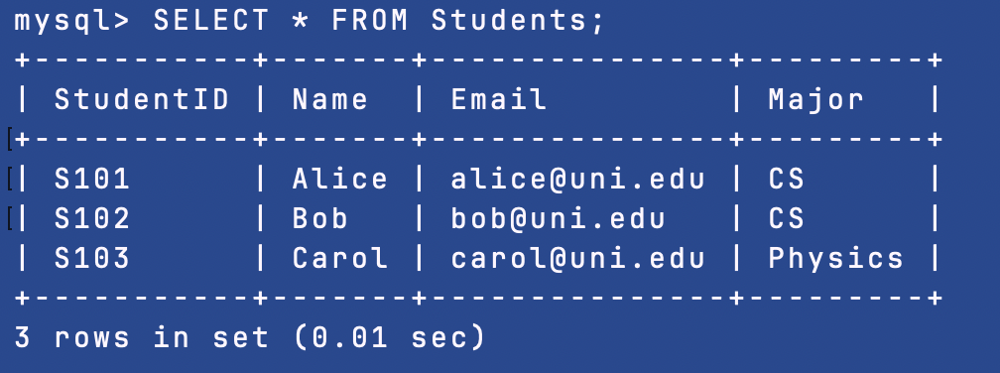
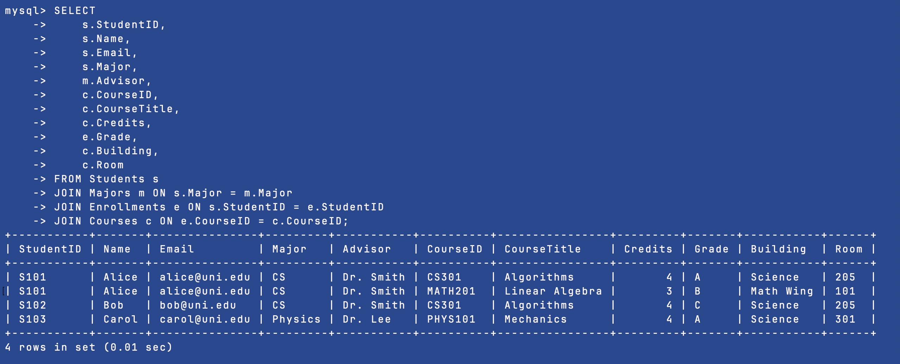

# Database Normalization Lab

> A class task to demonstrate database normalization from unnormalized table to a organized third normal form structure


## Learning Objective

You can learn the following things:

- ✅ **Problem Identification**: Identify problems in unnormalized data
- ✅ **Normalization**: Organizing data
- ✅ **SQL Commands**: Writing DDL
- ✅ **Verification**: Testing your database with queries

## Quick Start Guide

### Step 1: Get the Code

```bash
git clone git@github.com:0xh4ck3rm4n/database-task.git
cd database-task
```

### Step 2: Start MySQL with Docker

```bash
docker run --name lab \
  -e MYSQL_ROOT_PASSWORD=lab \
  -e MYSQL_DATABASE=uni \
  -d -p 3307:3306 \
  mysql:8.0
```

> **What this does:** Creates a MySQL database running in a container on port 3307

### Step 3: Load the Database

```bash
docker exec -i lab mysql -uroot -plab uni < sql/university.sql
```

> **What this does:** Runs all the SQL commands to create and populate your database

### Step 4: Check It Works

```bash
# View all students
docker exec lab mysql -uroot -plab -t uni -e "SELECT * FROM Students;"

# View all courses
docker exec lab mysql -uroot -plab -t uni -e "SELECT * FROM Courses;"

# See who's taking what courses
docker exec lab mysql -uroot -plab -t uni -e "
    SELECT
        s.Name AS Student,
        c.CourseTitle AS Course,
        e.Grade,
        c.Credits
    FROM Enrollments e
    JOIN Students s ON e.StudentID = s.StudentID
    JOIN Courses c ON e.CourseID = c.CourseID
    ORDER BY s.Name;"
```

## Understanding Normalization

### First Normal Form (1NF)

**Rule:** Each cell has atomic value

✅ The table given for the task already satisfies 1NF

### Second Normal Form (2NF)

**Rule:** Remove partial dependencies

**What I did:**

  1. Separated **student data** into Students table
  2. Separated **course data** into Courses table
  3. Kept **enrollments** separate with just the relationship

### Third Normal Form (3NF)

**Rule:** Remove transitive dependencies

**What I did:**

  1. Created **Majors table** because Advisor depends on Major, not StudentID
  2. Now changing an advisor only requires updating one row


## Task Structure

```
database-task/
├── images/              # Screenshots of results
│   ├── 1.png           # Show tables output
│   ├── 2.png           # Students table data
│   └── 3.png           # Full join query result
├── sql/
│   └── university.sql  # Complete database script
└── README.md           # You are here!
```


## Results

### Check Your Tables

```sql
USE uni;
SHOW TABLES;
```

**You should see:**


---

### View Student Data

```sql
SELECT * FROM Students;
```

**Output:**



---

### Joining Everything

```sql
SELECT
    s.StudentID,
    s.Name,
    s.Email,
    s.Major,
    m.Advisor,
    c.CourseID,
    c.CourseTitle,
    c.Credits,
    e.Grade,
    c.Building,
    c.Room
FROM Students s
JOIN Majors m ON s.Major = m.Major
JOIN Enrollments e ON s.StudentID = e.StudentID
JOIN Courses c ON e.CourseID = c.CourseID;
```

**This proves normalization works!** We can still get all the original data by joining tables.



---

## Testing Conditions

### Test 1: Can't Use Same Email Twice

```sql
INSERT INTO Students VALUES ('S105', 'Eve', 'alice@uni.edu', 'CS');
```

**Error:** `Duplicate entry 'alice@uni.edu' for key 'Email'`

Prevents duplicate accounts


### Test 2: Can't Enroll in Fake Course

```sql
INSERT INTO Enrollments VALUES ('S101', 'BIO101', 'A');
```

**Error:** `Foreign key constraint fails`

You can only enroll in real courses


### Test 3: Can't Delete Major with Students

```sql
DELETE FROM Majors WHERE Major = 'CS';
```

**Error:** `Cannot delete due to foreign key constraint`

Protects student data from accidental deletion


## Commands

### Access MySQL Shell

```bash
docker exec -it lab mysql -uroot -plab uni
```

### Stop the Container

```bash
docker stop lab
```

### Start Again Later

```bash
docker start lab
```

### Remove Everything

```bash
docker stop lab
docker rm lab
```


## 👨‍💻 Author

**Gaurav Poudel**  
Student

---

## 📄 License

This task is for educational purposes. You can use it!

---

<div align="center">

**I see you taking a peek A booo!**

</div>
